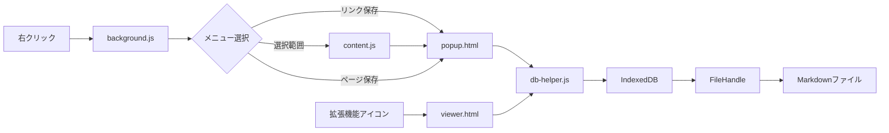

# Chrome拡張機能 基本設計書

## あとで読む（読まない） - Link Memo Saver

**Version**: 1.0.0  
**作成日**: 2026年2月7日  
**更新日**: 2026年2月7日  
**対象**: 開発者・レビュアー向け技術仕様書

---

## 1. プロジェクト概要

### 1.1 背景・目的

Web閲覧中に気になったリンクやページを素早くメモとして保存したいというニーズに応える。従来のブックマーク機能では以下の課題がある：

- メモや文脈を残しにくい
- タグで分類できない
- 後から検索・見返しにくい
- エクスポートが困難

本拡張機能は、**Markdownファイル**という汎用性の高い形式でローカル保存し、タグ機能や検索機能を備えることで、これらの課題を解決する。

### 1.2 実装済み機能（v1.0）

#### コア機能

- ✅ リンクの右クリックメニューからの保存
- ✅ 選択範囲からURLを保存（テキスト内のURL抽出 + リンク要素検出）
- ✅ 現在のページを保存（右クリックメニュー）
- ✅ URL・メモ・タグの入力
- ✅ ローカルMarkdownファイルへの追記

#### 管理機能

- ✅ 保存済みメモの一覧表示（カード形式）
- ✅ メモの編集・削除
- ✅ タグ機能（保存時に付与、タグクリックでフィルター）
- ✅ 検索機能（URL・メモ・タグから検索）

#### UI/UX改善

- ✅ トースト通知（保存成功時）
- ✅ 設定画面から一覧に戻るボタン
- ✅ モダンなダークテーマUI

---

## 2. 機能要件

### 2.1 コンテキストメニュー機能

#### 2.1.1 リンクをメモに保存

| 項目 | 内容 |
|------|------|
| トリガー | ページ内のリンク要素上で右クリック |
| メニュー表示 | 「リンクをメモに保存」項目を表示 |
| アクション | クリック時にメモ入力ポップアップを開く |
| 取得情報 | 対象リンクのURL（href属性） |

#### 2.1.2 選択範囲からURLを保存

| 項目 | 内容 |
|------|------|
| トリガー | テキスト選択後に右クリック |
| メニュー表示 | 「選択範囲からURLを保存」項目を表示 |
| アクション | 選択範囲からURLを抽出してポップアップを開く |
| 取得方法 | 1. リンク要素のhref属性を優先取得<br>2. 正規表現でテキストからURLを抽出<br>3. 両方から取得した場合は重複排除 |

#### 2.1.3 このページを保存

| 項目 | 内容 |
|------|------|
| トリガー | ページ本体（リンク以外）で右クリック |
| メニュー表示 | 「このページを保存」項目を表示 |
| アクション | 現在のページのURLとタイトルを取得してポップアップを開く |
| 取得情報 | 現在のタブのURL + ページタイトル（メモの初期値に設定） |

### 2.2 メモ入力ポップアップ

| 項目 | 内容 |
|------|------|
| URL入力欄 | 編集可能なテキストボックス。初期値はコンテキストメニューから取得したURL |
| メモ入力欄 | 複数行テキストエリア。ページ保存時はタイトルが初期設定される |
| タグ入力欄 | カンマ区切りでタグを入力。例：`技術, Chrome拡張, JavaScript` |
| 保存ボタン | クリック時、Markdownファイルに追記してトースト通知を表示 |
| キャンセルボタン | クリック時、ポップアップを閉じる（保存しない） |
| ウィンドウサイズ | 500px × 550px（スクロールなしで全要素が表示される） |

> [!IMPORTANT]
> **URL編集可能の理由**: リダイレクトURLや短縮URLを実際のURLに修正したいケースに対応。ユーザーの柔軟な運用を可能にする。

### 2.3 一覧表示・管理機能

#### 2.3.1 一覧表示

| 項目 | 内容 |
|------|------|
| 表示形式 | カード形式で新しい順に表示 |
| 表示内容 | タイムスタンプ、URL（リンク）、メモ、タグ |
| タグ機能 | タグをクリックすると、そのタグでフィルター |
| 検索機能 | URL・メモ・タグから部分一致検索（リアルタイム） |

#### 2.3.2 編集・削除

| 項目 | 内容 |
|------|------|
| 編集ボタン | モーダルを開いてURL・メモ・タグを編集 |
| 削除ボタン | 確認ダイアログ後、メモを削除 |
| 保存処理 | Markdownファイル全体を再生成して保存 |

### 2.4 ファイル管理機能

| 機能 | 実装方法 |
|------|----------|
| 初回起動 | 保存先未設定の場合、設定画面を自動表示 |
| ファイル新規作成 | File System Access APIの`showSaveFilePicker()`で.mdファイルを作成 |
| ファイル選択 | `showOpenFilePicker()`で既存.mdファイルを選択 |
| ファイルハンドル保存 | IndexedDBに永続化（`FileSystemFileHandle`） |
| 権限管理 | 書き込み前に`queryPermission()`で確認。失効時は再選択を促す |
| 一覧に戻る | 設定画面に「← 一覧に戻る」ボタンを配置 |

### 2.5 保存データ形式

Markdown形式で以下のフォーマットで追記：

```markdown
## YYYY-MM-DD HH:MM:SS
- URL: [ユーザーが入力/編集したURL]
- メモ: [ユーザーが入力したメモ内容]
- タグ: [tag1, tag2, tag3]

---
```

**例**:

```markdown
## 2026-02-07 17:15:32
- URL: https://github.com/chrome-extensions/samples
- メモ: Chrome拡張のサンプルコード集。Service Workerの実装を参考にする
- タグ: [技術, Chrome拡張, JavaScript]

---
```

---

## 3. 技術仕様

### 3.1 技術スタック

| 技術 | 用途 |
|------|------|
| Manifest V3 | Chrome拡張機能の最新仕様 |
| Vanilla JavaScript | フレームワーク不使用でシンプルに実装 |
| CSS3 | モダンなUI（ダークテーマ、グラデーション、トースト通知） |
| File System Access API | ローカルファイルへの読み書き |
| IndexedDB | ファイルハンドルの永続化 |
| Chrome Storage API | 一時データの保存 |

### 3.2 アーキテクチャ

#### ファイル構成

```
src/
├── manifest.json          # 拡張機能設定
├── background.js          # Service Worker（コンテキストメニュー管理）
├── content.js            # Content Script（選択範囲のリンク検出）
├── popup.html            # メモ入力UI
├── popup.js              # メモ入力ロジック
├── viewer.html           # 一覧表示UI
├── viewer.js             # 一覧表示・編集・削除ロジック
├── settings.html         # 設定UI
├── settings.js           # ファイル選択ロジック
├── db-helper.js          # IndexedDB操作ヘルパー
├── styles.css            # 共通スタイル
└── icons/
    ├── icon16.png        # 16x16 拡張機能アイコン
    ├── icon48.png        # 48x48 拡張機能アイコン
    └── icon128.png       # 128x128 拡張機能アイコン

```

#### データフロー



### 3.3 主要API

#### 3.3.1 Chrome Extensions API

| API | 用途 |
|-----|------|
| `chrome.contextMenus` | 右クリックメニューの追加・管理 |
| `chrome.storage.local` | 一時データの保存（pendingUrl など） |
| `chrome.windows.create()` | ポップアップウィンドウの作成 |
| `chrome.tabs.query()` | 現在のタブ情報取得 |
| `chrome.tabs.sendMessage()` | Content Scriptと通信 |

#### 3.3.2 File System Access API

| メソッド | 用途 |
|---------|------|
| `showSaveFilePicker()` | 新規ファイル作成ダイアログ |
| `showOpenFilePicker()` | ファイル選択ダイアログ |
| `FileHandle.createWritable()` | ファイル書き込みストリーム作成 |
| `FileHandle.getFile()` | ファイル読み込み |
| `FileHandle.queryPermission()` | 権限確認 |

#### 3.3.3 IndexedDB

| 用途 | 実装 |
|------|------|
| データベース名 | `LinkMemoSaverDB` |
| オブジェクトストア | `fileHandle` |
| 保存データ | `FileSystemFileHandle` オブジェクト |
| キー | `'savedFileHandle'` |

---

## 4. UI/UX設計

### 4.1 デザインシステム

#### カラーパレット

```css
:root {
  /* Primary Colors */
  --color-primary: #6366f1;      /* インディゴブルー */
  --color-primary-hover: #4f46e5;
  
  /* Backgrounds */
  --bg-main: #1f2937;            /* ダークグレー */
  --bg-card: rgba(31, 41, 55, 0.95);
  --bg-input: #374151;
  
  /* Text */
  --text-primary: #f9fafb;       /* ホワイト */
  --text-secondary: #9ca3af;     /* グレー */
  
  /* Accents */
  --color-success: #10b981;      /* グリーン */
}
```

#### トースト通知

- **位置**: 画面上部中央（fixed）
- **表示時間**: 3秒
- **アニメーション**: スライドイン/フェードアウト
- **背景**: グリーン（`--color-success`）

### 4.2 レスポンシブ対応

- ポップアップウィンドウ: 固定サイズ（500×550px）
- 一覧画面: フルスクリーン対応（max-width: 900px）
- モバイル非対応（Chrome拡張機能の制約）

---

## 5. セキュリティ・プライバシー

### 5.1 データ保存

- **完全ローカル**: すべてのデータはユーザーのPCに保存
- **外部通信なし**: ネットワーク通信は一切行わない
- **暗号化**: File System Access APIの標準セキュリティに準拠

### 5.2 権限

| 権限 | 用途 |
|------|------|
| `contextMenus` | 右クリックメニューの追加 |
| `storage` | 一時データの保存 |
| `activeTab` | 現在のタブ情報取得 |

### 5.3 Content Script

- **実行タイミング**: `document_end`
- **対象**: `<all_urls>`（すべてのページ）
- **用途**: 選択範囲内のリンク要素検出のみ
- **データ取得**: ページ内容は一切収集しない

---

## 6. パフォーマンス

### 6.1 最適化

- **軽量**: フレームワーク不使用で高速動作
- **非同期処理**: File System Access APIは非同期で実装
- **メモリ効率**: 必要なデータのみIndexedDBに保存

### 6.2 制約

- **ファイルサイズ**: Markdownファイルが大きくなると読み込みが遅くなる可能性
  - **推奨**: 定期的に別ファイルにアーカイブ
- **エントリ数**: 数千件以上で一覧表示が遅くなる可能性
  - **対策**: 検索・フィルター機能で絞り込み

---

## 7. テスト計画

### 7.1 機能テスト

- [x] リンク右クリック → 保存 → Markdownファイル確認
- [x] 選択範囲からURL抽出 → 保存
- [x] ページ右クリック → 現在のページ保存
- [x] タグ付与 → 一覧表示で確認
- [x] 検索機能（URL・メモ・タグ）
- [x] 編集・削除機能
- [x] トースト通知の表示

---

## 8. デプロイ・配布

### 8.1 開発環境での使用

1. `chrome://extensions/` を開く
2. デベロッパーモードをON
3. 「パッケージ化されていない拡張機能を読み込む」
4. `src` フォルダを選択

---

## 9. 今後の拡張予定

### 9.1 Phase 2（検討中）

- [ ] エクスポート機能（JSON、CSV）
- [ ] インポート機能
- [ ] タグの自動補完
- [ ] ショートカットキー対応
- [ ] 複数ファイル管理

### 9.2 Phase 3（アイデア）

- [ ] クラウド同期（オプション）
- [ ] チーム共有機能
- [ ] AI要約機能
- [ ] スクリーンショット保存

---

## 10. FAQ

**Q: データはどこに保存されますか？**
A: ユーザーが選択したローカルのMarkdownファイルに保存されます。

**Q: オフラインで使えますか？**
A: はい、完全にオフラインで動作します。

**Q: 他のブラウザでも使えますか？**
A: Chromium系ブラウザ（Edge、Brave等）で動作します。

**Q: データを他のPCに移行できますか？**
A: Markdownファイルをコピーするだけで移行できます。

---

**ライセンス**: MIT License
